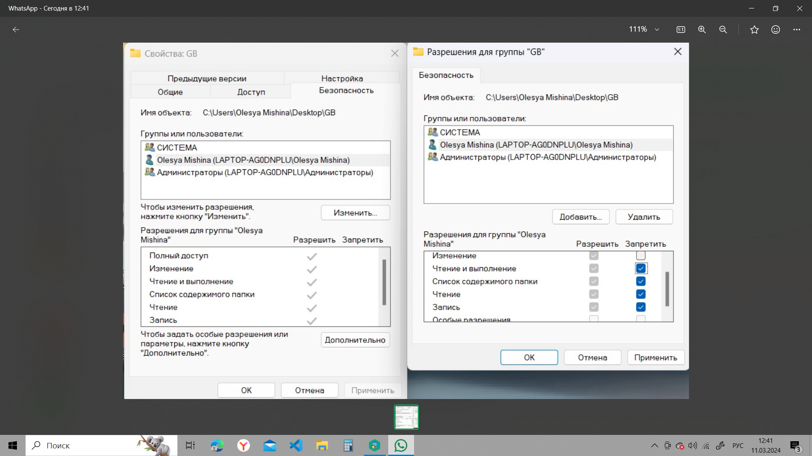
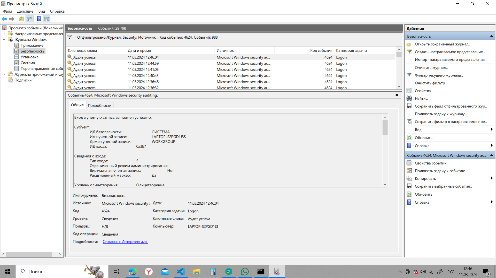

### Задание №2 (инструкция для Windows*)
Создать каталог, указать выбранного 
пользователя в Свойства -> Безопасность
* На примере Windows 10
Изменить права доступа 
(дополнительные разрешения)

### Задание №3 “Просмотр событий” (вопрос для Windows)
Семинар 3. Основные технологии и инструменты обеспечения ИБ (некриптографические)
Вам как ИБ-специалисту необходимо проанализировать историю входов в операционную систему Windows.
Вызвать MSC-оснастку «Просмотр событий» (Event Viewer) в Windows разными способами: 
● Комбинация WIN + R (или приложение «Командная строка») и ввести eventvwr.exe 
или eventvwr.msc, или eventvwr.
● Комбинация Windows + X и выбрать «Просмотр событий».
● Найти в каталоге %SystemRoot%\System32 eventvwr.exe или eventvwr.msc
Найти события успешного входа: id 4624.
Выйти из операционной системы, повторно войти, сначала введя неверный пароль, 
найти событие неуспешного входа: id 4625.
Ознакомиться с другими событиями и возможностями по фильтрации событий.

успешная аторизазия:

отказ в авторизации:

