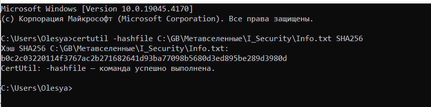
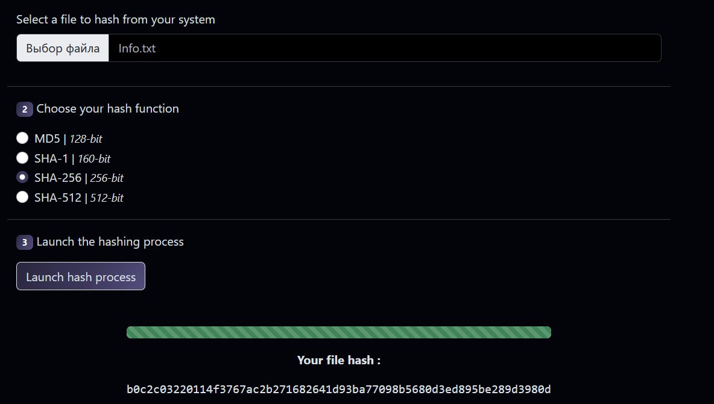

Задание №3. Расчет и проверка хэшей. Строка

Рассчитать хэш SHA-2 (длина хэша 256) для текста («test»):
- в командной строке: 
certutil -hashfile hash.txt SHA256 

Проверить полученные значения хэшей на веб-ресурсах: https://hash-file.online/

видим, что чэши одинаковые