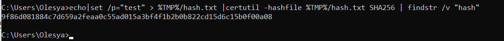

## Задание №3. 
### Расчет и проверка хэшей. Файл
Вам, как ИБ-специалисту, необходимо рассчитать хэш-значения для файлов резервных 
копий.
Рассчитать хэш SHA-2 (длина хэша 256) для файла с использованием встроенных средств 
Windows:
- в командной строке: certutil -hashfile "путь к файлу" SHA256

Проверить полученные значения хэшей на веб-ресурсах: https://hash-file.online

### Расчет и проверка хэшей. Строка

Рассчитать хэш SHA-2 (длина хэша 256) для текста («test»):
- в командной строке: echo|set /p="test" > %TMP%/hash.txt |certutil -hashfile %TMP%/hash.txt SHA256 | findstr /v "hash"

Проверить полученные значения хэшей на веб-ресурсах: https://hash-file.online/

Проверить полученные значения хэшей на веб-ресурсах: https://pi7.org/hash/sha256 и/или 
https://md5decrypt.net/en/Sha256/

видим, что чэши одинаковые